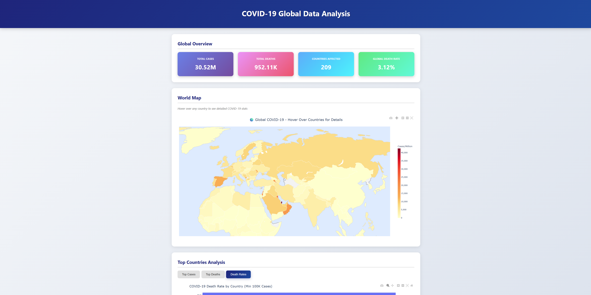
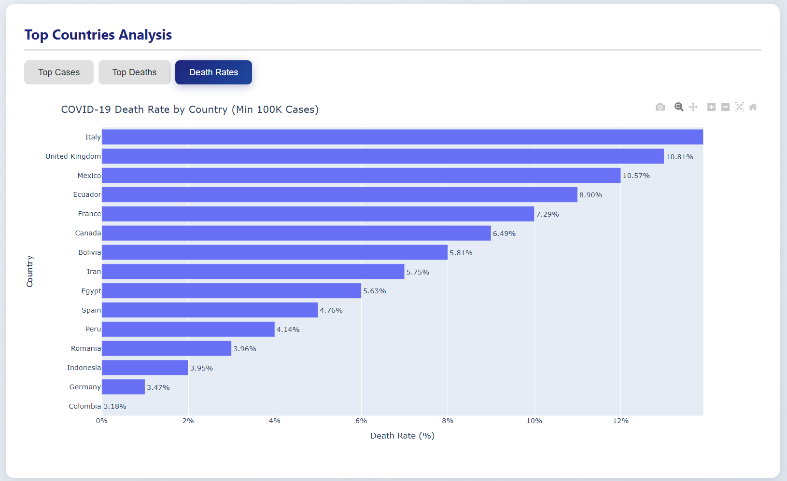
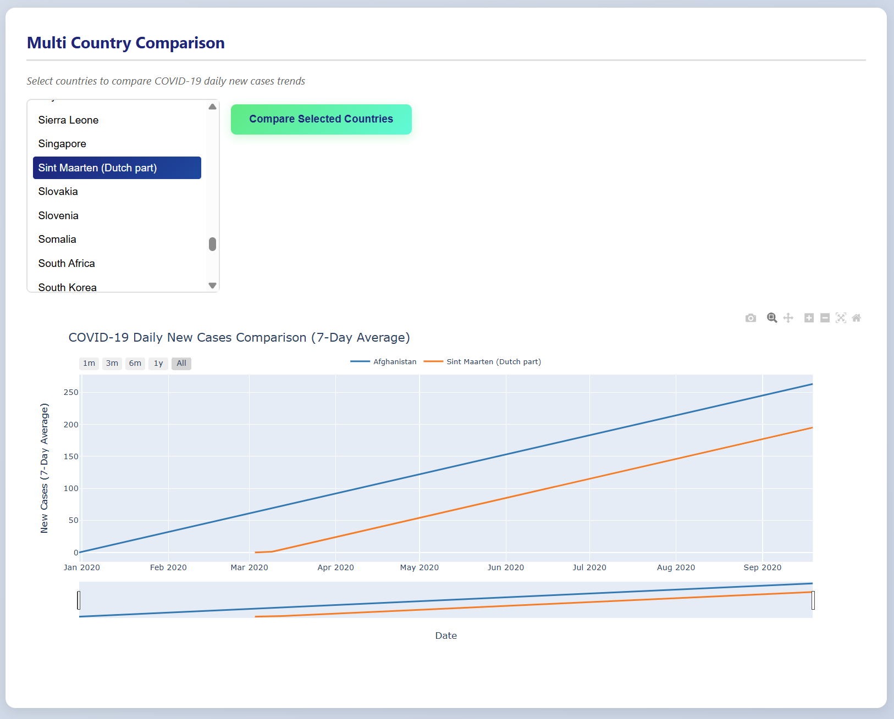

# 🦠 COVID-19 Global Data Analysis Dashboard

An interactive data science project that analyzes and visualizes global COVID-19 statistics using Python, Flask, and Plotly.


## 📸 Screenshots

### Global Overview & World Map


### Country Analysis


### Multi-Country Comparison


## ✨ Features

- **Interactive World Map**: Hover over countries to see detailed COVID-19 statistics
- **Global Overview**: Real-time statistics on total cases, deaths, and affected countries
- **Top Countries Analysis**: View countries with highest cases, deaths, and death rates
- **Continental Comparison**: Compare COVID-19 impact across continents
- **Country-Specific Analysis**: Detailed timeline and trends for individual countries
- **Multi-Country Comparison**: Compare trends across multiple selected countries
- **Interactive Charts**: Zoom, pan, and hover for detailed data exploration

## 🛠️ Tech Stack

| Category | Technologies |
|----------|-------------|
| **Backend** | Python, Flask |
| **Data Analysis** | Pandas, NumPy |
| **Visualization** | Plotly |
| **Frontend** | HTML5, CSS3, JavaScript |
| **Data Source** | Our World in Data |

## 📁 Project Structure
```
covid19-analysis/
│
├── data/
│ └── owid-covid-data.csv
│
├── src/
│ ├── init.py
│ ├── data_loader.py # Data loading functions
│ ├── data_cleaner.py # Data preprocessing
│ ├── analysis.py # Analysis functions
│ └── visualizations.py # Chart generation
│
├── static/
│ └── style.css # Styling
│
├── templates/
│ └── index.html # Frontend template
│
├── app.py # Flask application
├── requirements.txt # Dependencies
└── README.md
```

## 🔌 API Endpoints
```
Endpoint	Description
GET /	Main dashboard
GET /api/overview	Global statistics
GET /api/world-map	World map data
GET /api/top-cases	Top 10 countries by cases
GET /api/top-deaths	Top 10 countries by deaths
GET /api/death-rates	Death rate comparison
GET /api/continents	Continental statistics
GET /api/country/<name>	Country-specific data
GET /api/country-monthly/<name>	Monthly trends
GET /api/country-daily/<name>	Daily trends with 7-day average
GET /api/compare?countries=	Multi-country comparison
```
📈 Visualizations

```
Choropleth Map: Global case distribution
Horizontal Bar Charts: Top countries rankings
Line Charts: Time series trends
Area Charts: Cumulative growth
Multi-line Charts: Country comparisons
Bar + Line Combo: Monthly trends with deaths overlay

```

## 📊 Data Analysis Performed
Exploratory Data Analysis (EDA)
Data cleaning and preprocessing
Handling missing values
Date parsing and formatting
Statistical aggregations
Key Insights Generated
Countries with highest COVID-19 cases and deaths
Death rate comparison across countries
Continental impact analysis
Time series trends and patterns
7-day moving averages for trend smoothing

## 🎯 Key Learnings
Data wrangling with Pandas
Interactive visualization with Plotly
Building REST APIs with Flask
Frontend-backend integration
Responsive web design

## 🔮 Future Improvements
 Add vaccination data analysis
 Implement predictive modeling
 Add data export functionality
 Include more demographic correlations
 Add real-time data updates

## 🙏 Acknowledgments
Data Source: Our World in Data
Dataset: [Kaggle COVID-19 Dataset](https://www.kaggle.com/datasets/bolkonsky/covid19)

## 👨‍💻 Author
Uzair Nayyer 

LinkedIn: [Your LinkedIn](https://www.linkedin.com/in/uzair-nayyer-535298399/)


